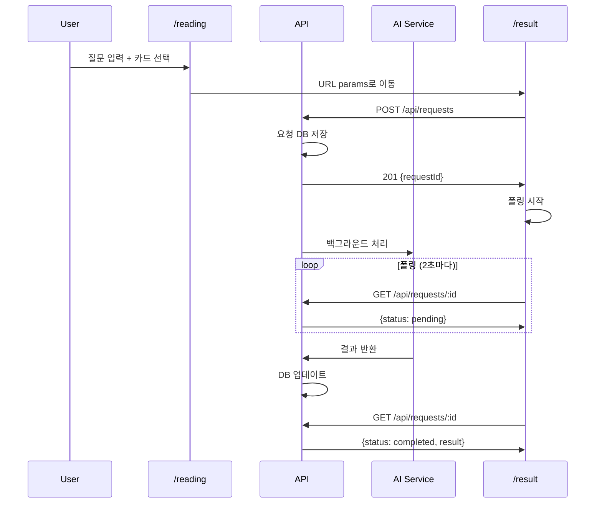

# Tarote App Agent 기술 지침

## 🎯 기술 아키텍처 개요
- **프레임워크**: Next.js 14 (App Router)
- **상태 관리**: Zustand (페이지별 독립)
- **아키텍처**: FSD (Feature-Sliced Design)
- **스타일링**: CSS Modules + Tailwind CSS
- **UI 라이브러리**: react-virtualized (카드 선택)

## 📋 Feature 분리 원칙

### `/reading` 페이지
- **Feature**: `tarotReading`
- **책임**: 질문 입력 + 카드 선택
- **상태 관리**: 페이지 내부 Zustand store
- **데이터 출력**: URL params로 `/result`에 전달

### `/result` 페이지
- **Feature**: `tarotResult`
- **책임**: AI 요청 + 폴링 + 결과 표시
- **상태 관리**: 독립적인 Zustand store
- **데이터 입력**: URL params에서 수신

## 🔄 비동기 AI 처리 아키텍처

### 전체 플로우


### API 설계
- `POST /api/requests`: AI 해석 요청 생성
- `GET /api/requests/:id`: 요청 상태 및 결과 조회
- 비회원 접근 제한: 결과 조회 시 403 응답

## 🛠️ 구현 우선순위

### Phase 1: 기본 구조
1. `tarotResult` feature 생성
2. URL params 파싱 로직
3. AI 요청 생성 API 연동
4. 기본 폴링 시스템

### Phase 2: UI 구현
1. LoadingStep (기존 LoadingPage 위젯 활용)
2. LoginPromptStep (비회원 유도)
3. ResultDisplayStep (해석 결과)
4. ErrorStep (에러 처리)

### Phase 3: 고도화
1. 에러 복구 메커니즘
2. 성능 최적화
3. 접근성 개선

## 📁 파일 구조
```
src/features/tarotResult/
├── CLAUDE.md
├── AGENT-GUIDE.md
├── index.ts
├── model/
│   ├── store.ts         # Zustand store
│   ├── provider.tsx     # Provider
│   └── types.ts         # 타입 정의
├── api/
│   ├── requests.ts      # API 호출
│   └── types.ts         # API 타입
├── ui/
│   ├── TarotResultFlow/
│   ├── LoadingStep/
│   ├── LoginPromptStep/
│   ├── ResultDisplayStep/
│   └── ErrorStep/
└── lib/
    ├── urlParser.ts     # URL 파싱
    ├── polling.ts       # 폴링 로직
    └── constants.ts     # 상수
```

## 🔧 기술적 제약사항
- **페이지 간 상태 공유 금지**: URL params만 사용
- **폴링 최적화**: 2초 간격, 최대 5분 제한
- **메모리 관리**: 컴포넌트 언마운트 시 폴링 중단
- **에러 처리**: 사용자 친화적 메시지 표시

## ⚠️ 주의사항
- LoadingPage 위젯 재사용 필수
- 비즈니스 로직은 CLAUDE.md 기준 준수
- 모든 상태 전이는 Mermaid로 문서화

---

> 구현 시 상위 CLAUDE.md의 비즈니스 요구사항을 우선 고려하세요.