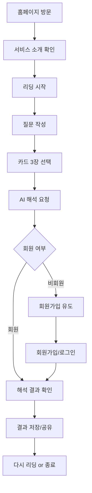

# Tarote - AI 타로 리딩 서비스

## 📋 서비스 개요
Tarote는 AI 기술을 활용한 온라인 타로 카드 리딩 서비스입니다. 사용자가 고민이나 질문을 입력하고 직감적으로 3장의 타로 카드를 선택하면, AI가 해당 카드들의 의미를 해석하여 통찰력 있는 조언을 제공합니다.

## 🎯 비즈니스 목표

### 핵심 가치 제안
- **접근성**: 누구나 쉽게 타로 리딩을 경험할 수 있는 디지털 서비스
- **즉시성**: 24시간 언제든지 즉석에서 타로 해석을 받을 수 있음
- **개인화**: AI가 개별 질문과 선택된 카드에 맞춘 맞춤형 해석 제공

### 수익 모델
- **프리미엄 전환**: 비회원은 요청만 가능, 결과 확인은 회원가입 필요
- **리텐션**: 회원의 이전 타로 리딩 히스토리 제공으로 재방문 유도

## 👤 타겟 사용자

### 주요 사용자층
- **타로 초보자**: 타로에 관심은 있지만 직접 배우기 어려운 사람들
- **일상 고민자**: 인생의 작은 결정들에 대해 다른 관점이 필요한 사람들
- **영성 탐구자**: 자기 성찰과 내면 탐구에 관심이 있는 사람들

### 사용자 니즈
- 판단이 어려운 상황에서의 새로운 관점 제공
- 심리적 위안과 격려
- 자기 성찰의 도구로 활용

## 🎪 핵심 기능

### 1. 질문 작성
- **목적**: 사용자가 타로에게 묻고 싶은 질문이나 고민 입력
- **특징**: 자유로운 텍스트 입력, 500자 제한
- **사용자 경험**: 직관적이고 편안한 글쓰기 환경 제공

### 2. 카드 선택
- **목적**: 직감적으로 3장의 타로 카드 선택
- **특징**: 시각적으로 매력적인 카드 덱 인터페이스
- **사용자 경험**: 마치 실제 타로 카드를 선택하는 듯한 몰입감

### 3. AI 해석
- **목적**: 선택된 카드와 질문을 바탕으로 AI가 개인화된 해석 제공
- **특징**: 비동기 처리로 빠른 응답성 보장
- **사용자 경험**: 기다리는 동안 신비로운 로딩 애니메이션 제공

### 4. 결과 확인 및 저장
- **목적**: 해석 결과 확인 및 개인 히스토리 관리
- **특징**: 회원만 결과 확인 가능 (회원 전환 유도)
- **사용자 경험**: 과거 리딩 기록 쉽게 조회 가능

## 🔄 사용자 여정

### 전체 플로우

### 비회원 사용자 여정
1. **진입**: 홈페이지에서 서비스 확인
2. **체험**: 질문 작성 + 카드 선택 (자유롭게 가능)
3. **전환점**: 결과 확인 시 회원가입 필요 안내
4. **전환**: 회원가입 후 결과 확인 가능

### 회원 사용자 여정
1. **리딩**: 질문 작성 + 카드 선택
2. **대기**: AI 해석 중 로딩 상태
3. **확인**: 해석 결과 즉시 확인
4. **관리**: 과거 리딩 기록 조회 및 관리

## 📱 주요 페이지 구성

### 홈페이지 (`/`)
- **목적**: 서비스 소개 및 시작 유도
- **핵심 요소**: 서비스 설명, 시작 버튼, 샘플 결과

### 리딩 페이지 (`/reading`)
- **목적**: 질문 입력 및 카드 선택
- **핵심 요소**:
  - 단계별 진행 표시
  - 질문 입력 폼
  - 타로 카드 선택 인터페이스

### 결과 페이지 (`/result`)
- **목적**: AI 해석 결과 표시
- **핵심 요소**:
  - 로딩 상태 (비회원도 볼 수 있음)
  - 로그인 유도 (비회원)
  - 해석 결과 표시 (회원)

## 🎨 브랜드 컨셉

### 디자인 방향
- **신비로움**: 타로의 전통적 신비로운 분위기
- **모던함**: 현대적이고 깔끔한 디지털 인터페이스
- **따뜻함**: 사용자에게 위안을 주는 친근한 톤앤매너

### 컬러 팔레트
- **주요 색상**: 보라색 계열 (신비로움)
- **보조 색상**: 금색 (고급스러움), 짙은 남색 (안정감)
- **포인트 색상**: 시안 (미래적 AI 이미지)

## 💼 비즈니스 전략

### 사용자 확보 전략
- **진입 장벽 최소화**: 비회원도 리딩 요청까지는 자유롭게
- **호기심 자극**: "결과가 궁금하지 않나요?" 심리 활용
- **가치 체험**: 먼저 서비스를 체험한 후 가입 결정

### 리텐션 전략
- **히스토리 제공**: 과거 리딩 기록으로 재방문 유도
- **주기적 알림**: 새로운 질문이나 고민이 생겼을 때 서비스 상기
- **커뮤니티**: 타로 해석 공유 및 토론 기능 (향후 계획)

---

> 이 문서는 Tarote 서비스의 비즈니스 명세입니다.
> 기술적 구현 세부사항은 AGENT-GUIDE.md를 참조하세요.