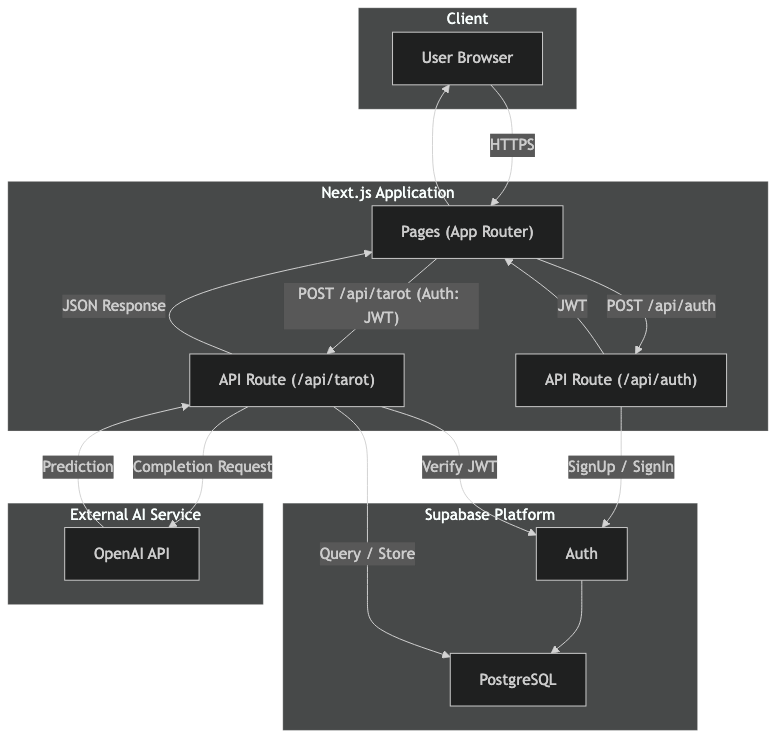
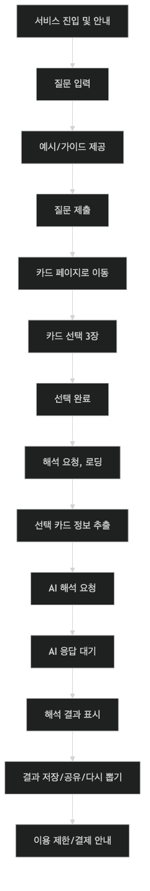

# Tarote 서비스 개요

Tarote 서비스는 타로 카드를 활용해 AI 기반 운세를 제공하는 웹 서비스입니다. 좌우로 롤링·슬라이스되는 카드 중 3장을 선택하면, 선택한 카드를 바탕으로 개인화된 타로 해석을 제공합니다.

## 핵심 요구사항

- **인증**: Google OAuth 기반 로그인 (유저 데이터 관리는 Supabase 사용)
- **AI 해석**: OpenAI API를 통해 카드 조합에 따른 맞춤형 해석 제공
- **요청 제한**: 하루 1회 무료, 추가 사용 시 결제 필요 (결제 시스템 추후 도입)

## 기술 스택 & 아키텍처

| 영역       | 사용 기술                                        |
| ---------- | ------------------------------------------------ |
| 프론트엔드 | Next.js 15.2.5 (App Router) · React · TypeScript |
| UI         | Tailwind CSS · shadcn/ui · Storybook             |
| 인증/DB    | Supabase                                         |
| AI         | OpenAI API                                       |
| 설계       | Nx 모노레포 · FSD 아키텍처                       |

## 플로우차트

