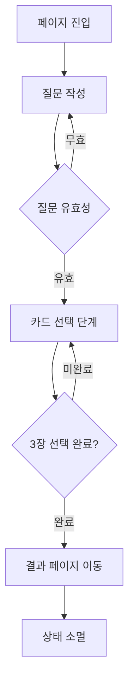

# TarotReading Feature - 질문 입력 및 카드 선택

## 📋 기능 개요
사용자가 타로 리딩을 위한 질문을 작성하고 직감적으로 3장의 타로 카드를 선택하는 기능입니다. `/reading` 페이지에서만 동작하며, 완료 후 `/result` 페이지로 이동합니다.

## 🎯 비즈니스 목적
- **사용자 참여**: 능동적인 질문 작성으로 개인화된 경험 제공
- **직감적 선택**: 타로의 전통적 방식인 직감적 카드 선택 구현
- **전환 준비**: 결과 확인을 위한 회원 전환 동기 부여

## 👤 사용자 스토리

### 질문 작성 단계
- **As a 사용자**: 고민이나 궁금한 점을 자유롭게 작성하고 싶다
- **So that**: 개인적이고 구체적인 타로 해석을 받을 수 있다
- **Acceptance Criteria**:
  - 500자 이내 자유 텍스트 입력
  - 실시간 글자수 표시
  - 빈 내용으로는 다음 단계 진행 불가

### 카드 선택 단계
- **As a 사용자**: 직감적으로 나에게 맞는 카드를 선택하고 싶다
- **So that**: 내 상황에 맞는 타로 메시지를 받을 수 있다
- **Acceptance Criteria**:
  - 정확히 3장만 선택 가능
  - 시각적으로 매력적인 카드 인터페이스
  - 선택 과정에서 몰입감 제공

## 🔄 사용자 플로우

## 📱 UI 구성

### 질문 작성 화면
- **제목**: "타로에게 묻고 싶은 질문을 작성해주세요"
- **입력 영역**: ChatGPT 스타일의 자연스러운 텍스트 입력
- **가이드**: "예: 새로운 직장으로 이직하는 것이 좋을까요?"
- **진행률**: Step 1/2 표시

### 카드 선택 화면
- **질문 요약**: 이전 단계에서 입력한 질문 간략 표시
- **카드 덱**: 뒷면이 보이는 타로 카드들
- **선택 상태**: "3장 중 X장 선택됨" 표시
- **진행률**: Step 2/2 표시

## 🎨 사용자 경험 원칙
- **신비로움**: 타로의 전통적 신비로운 분위기 유지
- **직관성**: 복잡한 설명 없이도 바로 이해 가능한 인터페이스
- **몰입감**: 실제 타로 리딩을 받는 듯한 경험 제공
- **안정감**: 각 단계마다 명확한 안내와 피드백

---

> 이 기능은 회원/비회원 구분 없이 모든 사용자가 자유롭게 이용할 수 있습니다.