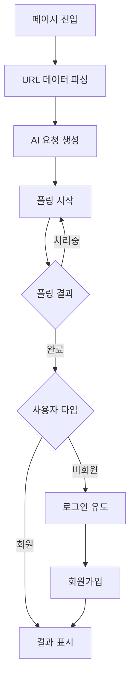

# TarotResult Feature - AI 해석 결과

## 📋 기능 개요
AI가 생성한 타로 카드 해석 결과를 표시하는 기능입니다. 비회원은 로딩 상태까지만 볼 수 있고, 실제 결과는 회원가입 후 확인 가능합니다.

## 🎯 비즈니스 목적
- **회원 전환**: 비회원을 회원으로 전환하는 핵심 지점
- **가치 제공**: AI 기반 개인화된 타로 해석 제공
- **리텐션**: 결과 저장으로 재방문 유도

## 👤 사용자 스토리

### 비회원 사용자
- **As a 비회원**: AI가 내 질문을 분석하는 과정을 보고 싶다
- **So that**: 서비스의 가치를 확인하고 가입을 결정할 수 있다
- **결과**: 로딩 → 회원가입 유도 → 가입 후 결과 확인

### 회원 사용자
- **As a 회원**: AI 해석 결과를 즉시 확인하고 싶다
- **So that**: 질문에 대한 통찰을 얻을 수 있다
- **결과**: 로딩 → 해석 결과 표시 → 저장/공유

## 🔄 사용자 플로우

## 📱 화면 구성

### 로딩 화면 (모든 사용자)
- **크리스탈 볼 애니메이션**: 신비로운 로딩 효과
- **상태 메시지**: "AI가 타로 카드를 해석하고 있습니다..."
- **예상 시간**: "잠시만 기다려주세요"

### 로그인 유도 화면 (비회원)
- **제목**: "🔮 타로 해석이 완성되었습니다!"
- **메시지**: "결과를 확인하려면 로그인이 필요해요"
- **액션**: 로그인 / 회원가입 버튼
- **혜택 안내**: "회원가입하면 이전 요청도 확인할 수 있어요!"

### 결과 화면 (회원)
- **전체 해석**: AI가 제공하는 종합적 해석
- **카드별 의미**: 선택한 3장 카드의 개별 의미
- **조언**: 실용적인 조언 메시지
- **액션**: 저장, 공유, 새로운 리딩

## 💡 핵심 가치
- **개인화**: 사용자의 질문과 선택에 맞춤화된 해석
- **신뢰성**: AI 기반의 일관되고 깊이 있는 분석
- **접근성**: 언제든 과거 결과 재확인 가능

---

> 이 기능은 서비스의 핵심 가치 전달과 회원 전환을 담당하는 중요한 기능입니다.